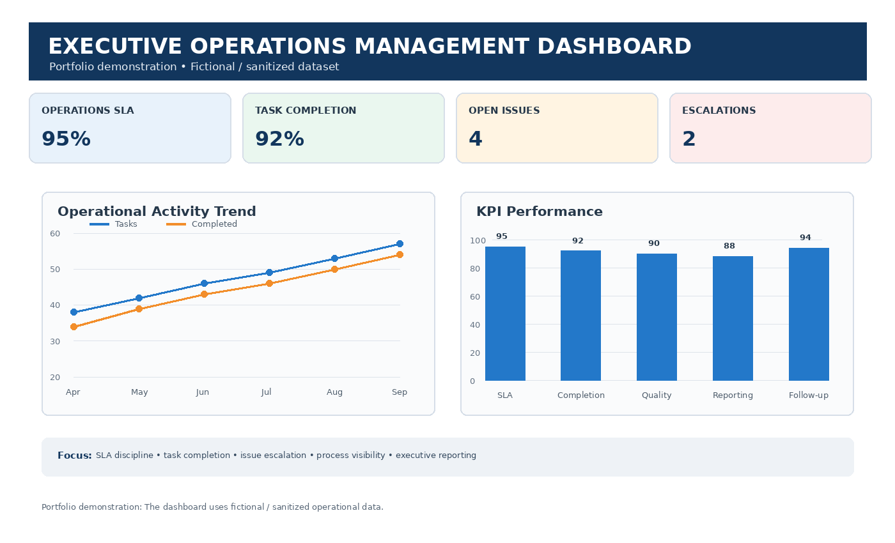

# Operations Management

> Executive operations management portfolio demonstrating task coordination, SLA tracking, issue escalation, process monitoring and management visibility.

## 🎯 Executive Operations Overview

Effective executive operations management requires structured coordination, timely follow-through and clear visibility across tasks, issues and priorities.

This portfolio demonstrates how operational activities can be organized, monitored and reported to support leadership decision-making.

## Core Responsibilities

| Area | Approach |
|---|---|
| Task Coordination | Track operational activities, owners, priorities and completion status |
| SLA Management | Monitor service-level timelines and identify overdue items |
| Issue Escalation | Identify exceptions, prioritize critical issues and coordinate resolution |
| KPI Monitoring | Track operational performance indicators and management metrics |
| Process Monitoring | Maintain visibility of recurring workflows and operational bottlenecks |
| Management Reporting | Consolidate operational information into concise management dashboards |

## 🔄 Executive Operations Workflow

**Request → Prioritize → Assign → Monitor → Escalate → Resolve → Report → Close**

## 📊 Operations KPI Dashboard

The dashboard provides a management-level view of operational workload, SLA performance, escalations and key productivity indicators.

## 📁 Portfolio Files

- `operations-kpi.csv` — Sample operational KPI dataset
- `operations-management-dashboard.png` — Executive operations dashboard
- `README.md` — Portfolio documentation

## 💼 Skills Demonstrated

- Executive operations coordination
- Task and priority management
- SLA monitoring
- Escalation management
- KPI tracking
- Management reporting
- Process monitoring
- Operational follow-through
- Stakeholder coordination
- Executive-level visibility

## 🔒 Data Disclaimer

All datasets, dashboards and examples in this repository are fictional/sanitized examples created for professional portfolio demonstration. No confidential client, employer or personal information is included.
